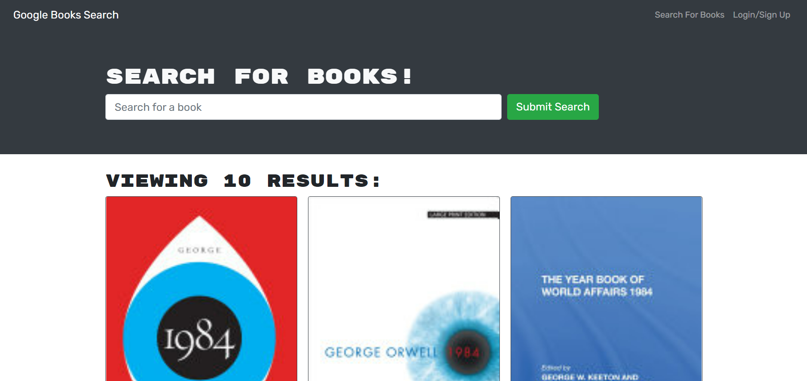

# Book Search Engine

## Website

## Description

A book search engine that uses a restful API and GraphQL built with an Apollo server.

## Table of Contents

- [Built With](#built-with)
- [Installation](#installation)
- [Usage](#usage)
- [Screenshots](#screenshots)
- [Acknowledgements](#acknowledgements)
- [Questions](#questions)
- [Author](#author)

### Built-With

### Installation

Clone the repository in the CLI: `git clone https://github.com/mavila6/book-search-engine.git`. To install necessary dependencies, run the following code in the console: `npm i`. You may have to run `npm i` in the root CLI, the client CLI, and the server CLI in order to install all dependencies.

### Usage

Run `npm run develop` in the CLI in the root of the application and the live server should run on localhost PORT 3000.

### Screenshots

### Acknowledgements

- Collaborated with [Kama Castaneda](https://github.com/kamacasta) to complete this challenge.

- Used [Jeremy Lentz's](https://github.com/jlentz17/MERN-book-search-engine) code for refernce on this assignment.

### Questions

If you have any questions feel free to take a look at my [GitHub](https://github.com/mavila6) or contact me at mavila6@email.arizona.edu

### Author

&copy; 2021 Marco Avila
